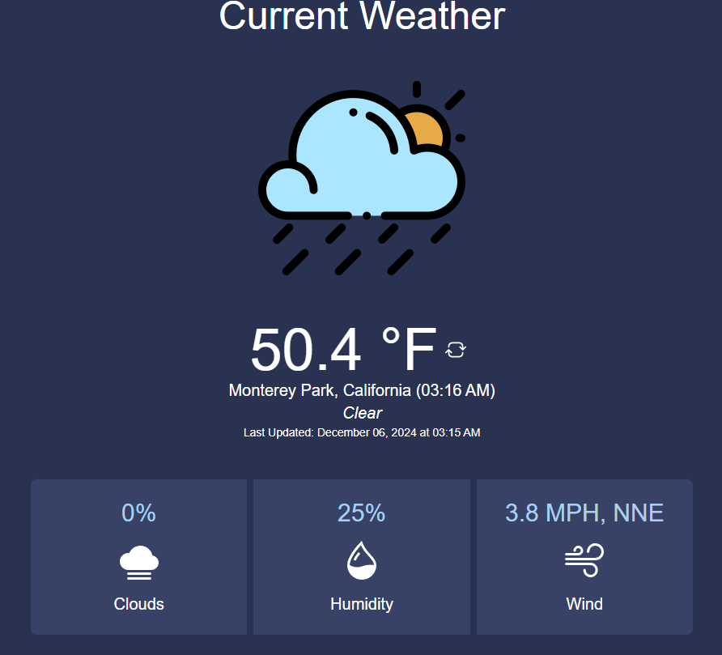

# CS 4080 Fall 24 Capstone Project: Weather Web App
- A web-based application allowing for users to view weather updates in real time based on their current location. Weather updates are provided by [WeatherApi](https://www.weatherapi.com/).

# Preview


# Installation Instructions
1. Clone the repository
2. Install [.NET Version 9.0.0](https://download.visualstudio.microsoft.com/download/pr/10bb041d-e705-473e-9654-27c0e038f5bd/447c0c10654c2949872fa6154b8c27b5/dotnet-sdk-9.0.100-win-x64.exe)
3. Create a `appsettings.json` and `appsettings.Development.json` file in the root directory of the project and add the following code:
```json
{
  "Logging": {
    "LogLevel": {
      "Default": "Information",
      "Microsoft.AspNetCore": "Warning"
    }
  },
  "AllowedHosts": "*",
  "WeatherApiKey": "<WeatherAPI API key>"
}

``` 
4. Run the project with `dotnet run` in the terminal

# Contributors
- Austin Pan
- David Wei
- Jason Agus
- Joshua Ho
- Jason Ly
